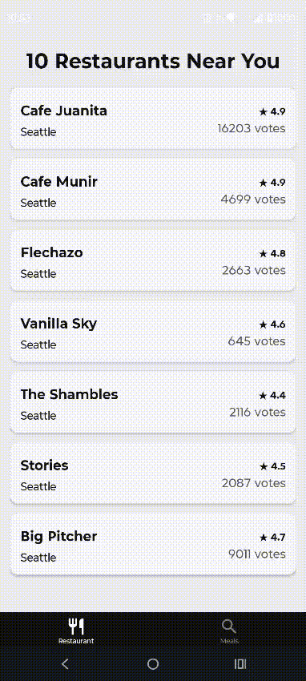

# Restaurant + Meals App (Expo Router)

Aplicacion React Native con Expo Router que incluye dos flujos:

- `Restaurant` tab: listado de restaurantes desde la API mock de HackerRank.
- `Meals` tab: buscador de recetas con TheMealDB + detalle de receta.



## Funcionalidades

### Tab: Restaurant

- Fetch de restaurantes desde:
  - `https://jsonmock.hackerrank.com/api/food_outlets`
- Loader inicial con `ActivityIndicator` (`testID="progress"`).
- Header con formato: `<count> Restaurants Near You`.
- Lista con `FlatList`.
- Render de item con nombre, ciudad, rating y votos.
- Paginacion con `page` y `total_pages` al hacer scroll.

### Tab: Meals

- Busqueda por nombre usando TheMealDB:
  - `https://www.themealdb.com/api/json/v1/1/search.php?s=<query>`
- Debounce en input para evitar requests por cada tecla.
- Cards con imagen y nombre del meal.
- Navegacion al detalle por id:
  - `https://www.themealdb.com/api/json/v1/1/lookup.php?i=<id>`
- Detalle con imagen, categoria, area, ingredientes e instrucciones.
- Shared Element Transition entre card y hero del detalle usando `react-native-reanimated` (`sharedTransitionTag`).
- Header custom en el detalle (boton back).
- Estado vacio con Lottie aleatorio desde `assets/lotties` cada vez que la lista queda vacia.

## Estructura principal

- `app/(tabs)/index.tsx`: pantalla `Restaurant` (listado + paginacion).
- `app/(tabs)/explore.tsx`: pantalla `Meals` (search + listado).
- `app/meal/[id].tsx`: detalle de meal.
- `features/restaurant/*`: tipos, estilos y componentes del modulo restaurant.
- `features/meals/*`: tipos y API helpers de meals.
- `app/(tabs)/_layout.tsx`: tabs (`Restaurant` y `Meals`).

## Scripts

Instalar dependencias:

```bash
npm install
```

Iniciar app:

```bash
npm start
```

Android:

```bash
npm run android
```

iOS:

```bash
npm run ios
```

Web:

```bash
npm run web
```

Lint:

```bash
npm run lint
```

## Notas

- Se usa `SafeAreaView` de `react-native-safe-area-context`.
- Proyecto configurado como development build (scripts `expo run:android` y `expo run:ios`).
- Feature flag habilitada en `package.json`:
  - `reanimated.staticFeatureFlags.ENABLE_SHARED_ELEMENT_TRANSITIONS = true`
- `newArchEnabled` esta activo en `app.json`.
- Dependencias actuales:
  - `expo ~54.0.33`
  - `react-native-reanimated 4.2.2`
  - `react-native-worklets 0.7.4`
- Nota de compatibilidad: Expo SDK 54 espera versiones distintas de Reanimated/Worklets. Si aparecen problemas, revisar `npx expo install --check`.
- `package.json` actualmente no incluye script `test`.
- Los assets Lottie estan en `assets/lotties/`.
